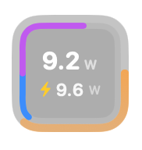

# MacBattery

<p align="center">
  
</p>

<div align="center">

[](https://github.com/zioon/MacBattery/releases)
[](https://github.com/zioon/MacBattery/actions)
[]()
[]()

</div>

一款 macOS 置顶挂件（HUD），实时显示电脑电量、充电功率与整机功率，并附带历史功率图表、电池健康记录与应用内更新。

- **电量圆环**：外圈一圈进度弧 = 电量百分比，环色随电量平滑过渡（红 → 橙 → 黄绿 → 绿 → 青绿），右下角有小百分比徽章
- **充电环**：充电时进度弧外侧出现一圈矩形充电环，带呼吸光晕 / 扫过高光 / 闪电脉冲等特效，颜色随电量与充电状态变化
- **整机功率**（W）：第一行大数字
- **充电功率**（W）：第二行，充电中显示 ⚡ 图标与瓦数，下方附电压 · 电流小字（如 `12.3V · 1.2A`）
- **CPU / RAM**：内圈上下半环实时显示 CPU 与内存占用
- **历史图表**：记录并可视化电量、充电电压 / 电流、整机功率与 CPU / 内存占用
- **电池健康**：记录并可视化循环次数、当前 / 设计容量与健康度曲线
- **充电上限**：可设定充电上限（如 80%），到达就暂停充电（需安装 root helper，见下文）
- **可隐藏**：不想看见挂件时可一键隐藏，只留菜单栏图标（采样、日志与充电上限照常运行）

窗口透明、置顶、鼠标穿透，不阻塞任何操作。纯 Xcode/SwiftUI 开发，仅依赖系统自带的 SMC/IOKit 接口，无第三方依赖。

> 目标平台：macOS 12+，**Intel Mac 优先**（整机功率走 SMC 读取）。

---

## 用法

### 方式一：Swift / SPM（推荐，最快）

前置：安装 Xcode 或仅安装 Command Line Tools（自带 `swift`）。

```bash
cd <MacBattery 工程目录>
swift run
```

编译完成后会自动启动浮窗，出现在**屏幕右上角**。

产物（可执行文件）为 `.build/debug/MacBattery`。正式使用时：

```bash
swift build -c release
```

### 方式二：打包成 .app（可选）

```bash
swift build -c release --arch arm64   # 按你的架构调整
# 将 .build/release/MacBattery 拷入你自建的 MacBattery.app/Contents/MacOS/
# 并补一个最小 Info.plist，即可双击运行、固定到 Dock。
```

### 交互

- Ctrl + C 在运行它的终端里退出；
- 菜单栏图标提供全部窗口入口、挂件显隐与「检查更新…」（⌘G 历史图表、⌘H 电池健康、⌘, 设置）；
  把挂件隐藏后，菜单栏图标是回到它的入口；
- 历史图表 / 电池健康窗口支持滚轮缩放时间窗、拖拽平移、鼠标悬停看数值。

---

## 语言（国际化）

- **支持语言**：简体中文（默认语言，同时是回退目标）、English。在设置窗口顶部的「语言」里切换，
  **即时生效、无需重启**；选择持久化在 `MacBattery.Settings.language`，不写入 `AppleLanguages`、不改系统偏好。
- **首次启动**：按系统首选语言自动匹配（`en-*` → English，`zh-CN` / `zh-Hans-*` → 简体中文）；
  都不匹配时使用默认语言简体中文（繁体 `zh-Hant-*` 属第二批候选，当前回退到简体）。
- **回退机制**：某条文案在所选语言缺失时回退到默认语言；两处都缺时显示键名并写入日志 —— 不崩溃、不留空白。
- **数字与日期按区域格式化**：小数分隔符、12/24 小时制、日期顺序都随语言（英文区域用 12 小时制）。
- **新增文案**：代码里写 `L("your.key")`，再到 `Sources/MacBatteryCore/Resources/<lang>.lproj/Localizable.strings` 补条目；
  复数用 `<key>.one` / `<key>.other` 后缀。漏翻译不会让界面出问题，但会让 CI 的键名一致性测试失败。
- **改文案时的铁律**：SwiftUI 里必须写 `Text(L("key"))`，**不要**写 `Text("中文")` ——
  字面量会被当成 `LocalizedStringKey` 走 `Bundle.main`，绕过应用内的语言选择，表现为「切了语言这一处不变」。
  CI 的 `Scripts/check_hardcoded_strings.py` 会拦下这类残留；`logger.error(...)` 等日志调用里的中文属**刻意保留**
  （日志面向排查，本地化后同一条故障在不同语言下文本不同、无法检索），脚本按调用形态豁免。
- **CI 还会跑 `Scripts/check_localization_keys.py`**：校验各语言键名一致（漏翻译即失败）、格式占位符数量一致、
  以及代码里引用的键确实存在（`L("拼错的键")` 在运行时会在界面上显示键名，靠这个提前拦住）。

---

## 在线自动更新

- **启动时自动检查**：查询 GitHub Releases（`zioon/MacBattery`）最新版本，与当前版本比对。
- **发现新版本自动下载**：把 DMG 下载到「下载」文件夹（命名为 `MacBattery-<版本>.dmg`），并弹窗提示，可在访达中直接打开安装。
- **手动检查**：菜单栏图标 →「检查更新…」，或设置面板中的「检查更新」按钮。
- 版本号取自 `.app` 的 `Info.plist` 的 `CFBundleShortVersionString`（发版时由 CI 用 tag 覆盖）；
  `swift run` 直接运行裸二进制时回退到 `Updater.swift` 中的 `AppVersion.fallback`。
- 安装：打开 DMG，把 `MacBattery.app` 拖入「应用程序」覆盖旧版本即可（应用不会自我替换，避免签名与权限风险）。
  DMG 根目录已放好一个指向 `/Applications` 的「应用程序」快捷方式，无需再手动开一个访达窗口。

> **首次打开提示**：当前发布的 App 只做 ad-hoc 签名（未使用 Apple 开发者证书）。首次双击运行可能被 Gatekeeper 拦截并提示"无法验证开发者"。此时请**右键点按 App 图标 →「打开」**，或前往「系统设置 → 隐私与安全性」点「仍要打开」即可放行。

---

## 数据来源与限制

| 数据 | 来源 | 权限 |
|---|---|---|
| 电量百分比 | IOKit Power Sources（`IOPSCopyPowerSourcesInfo`） | 无需 root |
| 充电功率 | AppleSmartBattery 电压 × 电流（充电时取电流绝对值） | 无需 root |
| 电压 · 电流小字 | AppleSmartBattery | 无需 root |
| CPU / 内存 | POSIX / 系统接口 | 无需 root |
| 整机功率 | AppleSMC 直读 / root helper / 估算回退 | 视机型/系统；读不到时回退为估算值，UI 上以 `~` 前缀标注 |
| 充电上限（暂停充电 / 限制最大充电量） | AppleSMC `CH0B` / `CH0C` 或 `BCLM` | **需 root**（同一个 root helper） |

### 关于整机功率

macOS 没有读取"整机功耗"的官方公开 API。本实现通过 AppleSMC 探测一组候选键（`PSTR`、`PDTR`、`PCHC`、`PSYS`、`PWRS`，候选列表由 `Sources/SMCBridge/SMC.c` 唯一定义）。

- **部分 Intel 机型 / 部分 macOS 版本**可以读到，此时显示真实瓦数；
- 读不到时回退为经验公式估算值（默认 TDP 45W，可在设置里调整），**UI 上会以 `~` 前缀标注以示区分**，这属正常现象，与该机固件未暴露功耗键有关，**并非程序错误**。

如需确定功耗，可临时用系统自带工具交叉验证（需管理员密码）：

```bash
sudo powermetrics --samplers smc -i 1000
```

若你希望通用性更强（覆盖更多 Intel 机型 / 自动回退到 IOReport 累加预估），可后续扩展 `Sources/MacBattery/SMC.swift` 与 `PowerMonitor.swift`。

## 真实整机功率（可选，需一次性 sudo）

Intel 机型上 macOS 不向普通权限暴露系统总功耗（`PSTR`），因此默认整机功率为估算值。
如需**真实整机功率**，可安装一个 root helper 守护（与 MacMonitor 同思路，一次性授权）：

```bash
cd 工程目录
sudo ./Scripts/install_helper.sh
```

- helper 以 root 常驻，每秒读一次 SMC `PSTR` 整机功耗，写入 `/tmp/macbattery_power.json`；
- 挂件每秒读取该文件，读到即显示真实值；
- 验证：`cat /tmp/macbattery_power.json`
- 卸载：`sudo launchctl bootout system /Library/LaunchDaemons/com.zioon.macbattery.helper.plist` 再删掉该 plist 与 `/Library/PrivilegedHelperTools/macbattery-helper`。

DMG 内已附带 `macbattery-helper` 二进制与 `install_helper.sh`，解压后在挂件工程内执行即可。

---

## 充电上限（充满即停，可选，复用同一个 root helper）

给电池设一个充电上限（如 80%）：接电时充到上限就暂停，长期插电办公能明显减缓电池损耗。

> **为什么需要 root helper**：macOS **没有公开 API 能停止充电**，只能写 AppleSMC 的键，**需要 root 权限**，
> 所以复用上面那个守护（`sudo ./install_helper.sh`）。
> **没装 helper 时本功能不会生效** —— 界面会明确写出原因，不会假装成功。

### 硬件机制（由 helper 探测，机型之间不统一）

| 机制 | 键与取值 | 说明 |
|---|---|---|
| 抑制充电 | `CH0B` / `CH0C` = `0x02`（抑制）/ `0x00`（允许） | 开关式：到上限就停、回落到「上限 − 5%」再恢复 |
| 最大充电量 | `BCLM` = 一个 `0…100` 的百分数 | **解除 = 写回 100**；不看是否接电（持久设置） |

helper 每次回执都会带上本机实际用的是哪一个，App 据此选决策方式 —— 两套机制的语义不同，
共用一套判定会出错：`BCLM` 若也按电量来回切，电量回落到迟滞带以下时会把上限整个撤掉（写回 100），
电池就一路充回 100%。

> 实测 `MacBookAir8,1`（2018 款 T2 Intel MacBook Air）**没有** `CH0B`/`CH0C`，只有 `BCLM`。
> 用 `BCLM` 时若系统开着「优化电池充电 / 电池健康管理」，写入可能被系统覆盖 —— 建议二选一。

### 参数

| 参数 | 取值 | 说明 |
|---|---|---|
| 开关 | 开 / 关（默认**关**） | 关闭时不下发任何指令，行为与旧版本完全一致 |
| 充电上限 | 50%–100%，步长 5%，默认 **80%** | **100% = 不限制**，与关闭等价 |
| 迟滞带宽 | 固定 5% | 达到上限后要回落到「上限 − 5%」才恢复充电，避免在阈值附近反复启停 |

### 触发条件

**抑制机制**（`CH0B`/`CH0C`）：接外电 + 功能开启 + 电量 **≥** 上限 → 暂停充电；
电量 **≤** 上限 − 5% → 恢复充电。其中任一不满足则不下发指令：

- **功能关闭 / 上限为 100%** —— 完全不干预（尤其不写 SMC）；
- **未接外电** —— 断电时抑制充电没有意义，且要避免拔电后还残留一条「禁止充电」。

判定用的是「是否接着外电」而不是「是否正在充电」：已插电但充电被暂停时后者为 false，
用它判定会在刚到上限的瞬间误判成没插电、撤回抑制，下一拍又重新抑制 —— 每秒一次启停振荡。

**最大充电量机制**（`BCLM`）：只看"要不要限制" —— 功能开启且上限 < 100% → 把上限写进硬件；
关闭或上限 100% → 写回 100。**不按电量来回切，也不看是否接电**（它是持久设置）。

### 交互反馈

- **设置面板**：开关、上限滑块（右侧即当前上限数值）、以及一行为**实际生效状态**——
  已关闭 / 上限 100% 不限制 / 充电中（会在 80% 暂停）/ 已到上限（充电已暂停）/ 未接电源 /
  未装 helper / helper 未在运行 / helper 版本过旧 / 未找到可用的充电抑制键 /
  检测到键但取值不在已知范围。
- **挂件**：充电环上多一条**上限刻度线**（位置就是上限），到达上限后行首图标变 `bolt.slash`、
  该行显示「限充中」、下一行显示上限值 —— 刻度是位置、数字是数值，两处互相印证。
- **菜单栏**：多一项「充电上限（80%）」，勾选态即开关，标题带当前上限。

### 安全性 / 故障安全

- **不会留哑火状态**：App 每 5 秒刷新一次指令；超过 30 秒没刷新（App 退出 / 崩溃）时，
  helper 会**解除限制**（抑制机制写「允许充电」、`BCLM` 写回 100）。宁可功能失效，
  也不能出现「关掉挂件后电永远充不满」这种用户自己解不掉的状态。
  > 反过来也意味着：**上限只在 App 运行期间有效**。这与其他同类工具把设置写进硬件后长期保留的做法
  > 不同 —— 这里刻意选"不留残留"，代价是关掉 App 就不再限制。
- **写什么不由指令文件决定**：`/tmp` 是全局可写的，任何本地用户都能伪造指令文件，因此
  helper 只接受白名单动作（inhibit / allow）、只写白名单内的键与取值
  （`CH0B`/`CH0C` × `0x00`/`0x02`，或 `BCLM` × `0…100`），且只写 `dataSize == 1` 的键。
  指令文件里没有任何字段能表达「写别的键 / 别的值」。
- **写完读回校验**：部分机型固件会静默忽略写入，不校验就会向界面谎报「已限充」。
- **越界值拒绝执行**：指令里的上限不在 `50…100` 时直接不下发（而不是"顺手改成合法值"）——
  指令可能来自被伪造的文件，正确的处理是保持硬件现状。
- **不认识的键不动**：读到的当前值不是已知取值时跳过该键（不同机型对 `CH0B`/`CH0C` 的解释并不统一；
  `BCLM` 的当前值不在 `0…100` 也判为不可用）。一个可用的机制都没有时，界面显示不可用并给出原因（见下条）。
- **显示不可用时怎么查**：设置面板里会把**两件事分开显示** ——
  一条是**功能是否生效**（不会断开充电 / 已到上限 …），一条是 **root helper 的当前状态**
  （运行中并带「回执 N 秒前」、SMC 可读性；或未安装 / 未在运行 / 版本过旧）。
  于是「装了 helper 却只看到一句不支持」这类困惑可以当场自证：helper 在跑、SMC 可读，
  说明问题只出在**键**上。
  「没找到可用键」还有两种成因，界面会同时给出一行 **SMC 探测结果**
  （每个候选键是否存在、dataSize、原始取值）：
  **键一个都不存在**（机型没有该能力）／**键存在但取值不在已知范围**（缺一个取值映射，可救）。
  这一行里的键名有两部分：我按公开实现列的候选键，以及 helper **枚举本机 SMC 键命名空间**
  得到的、前缀为 `CH` / `BC` / `BF` / `AC` 的真实键名 —— 枚举是为了不再靠猜键名
  （不同机型用的键并不统一）。
  黑匣子在：
  ```bash
  cat /tmp/macbattery_charge_status.json
  ```
  `probed` 是逐键探测结果，`error` 是失败代码（`smc_open_failed` / `no_charge_key` /
  `write_failed` / `verify_failed` / `no_effect`）。
- **升级须知**：改了 helper 的行为后需要**重新运行一次 `install_helper.sh`**；
  旧版 helper 与新版 App 之间靠协议版本号互相识别，版本不符时界面会提示重装，
  而不会按错位的字段执行。

### 与系统设置的关系

若同时开启「系统设置 → 电池 → 优化电池充电 / 电池健康管理」，两者可能互相干扰（都在
80% 附近做动作），建议二选一。本功能把上限设为 100% 时不做任何干预，也是为了避免这种拉扯。

---

## 数据持久化

数据以 CSV 异步持久化（不阻塞界面）：

- 功率 / 电量日志：`~/Library/Application Support/MacBattery/power_log.csv`
- 电池健康日志：`~/Library/Application Support/MacBattery/battery_health_log.csv`（按「值变化」或「距上次记录超 6 小时」任一触发落盘）

---

## 结构

```
Sources/
├── MacBattery/
│   ├── main.swift                  # 入口
│   ├── AppSettings.swift           # 设置项持久化（含界面语言）
│   ├── FloatingPanel.swift         # 置顶透明穿透浮窗 + 位置
│   ├── PowerHUDView.swift          # 电量圆环 + CPU/RAM 半环 + 两行功率 UI
│   ├── PowerMonitor.swift          # 后台采样 + 结果发布（SMC/IOKit 不阻塞 UI）
│   ├── PowerLogger.swift           # 功率 / 电量 CSV 异步持久化
│   ├── PowerChartView.swift        # 历史功率图表
│   ├── PowerChartPanelController.swift
│   ├── Battery.swift               # 电量 + 充电功率 + 电压电流（IOKit 官方 API）
│   ├── BatteryHealthLogger.swift   # 电池健康采样与 CSV 落盘
│   ├── BatteryHealthChartView.swift# 电池健康图表
│   ├── BatteryHealthPanelController.swift
│   ├── SettingsView.swift          # 设置面板
│   ├── SettingsWindowController.swift
│   ├── LocalizationManager.swift   # 界面语言运行时状态（语言变化驱动重绘）
│   ├── Updater.swift               # 在线自动更新（GitHub Releases + DMG 下载）
│   ├── ChargeLimiter.swift         # 充电上限：驱动决策、下发指令、回报实际状态
│   ├── SMC.swift                   # AppleSMC 整机功率读取
│   └── SystemPower.swift           # 整机功率数据源（含估算 / 真实 helper 值）
├── MacBatteryCore/                 # 纯逻辑层（禁止 AppKit/IOKit/SwiftUI，可独立单测）
│   ├── ChargeLimit.swift           # 充电上限的参数与决策规则（阈值 / 迟滞 / 触发条件）
│   ├── ChargeLimitWire.swift       # App ↔ helper 的指令/回执协议（唯一定义处）
│   ├── Localization/               # 多语言引擎：语言解析、三级回退、区域化数字/日期
│   └── Resources/
│       ├── zh-Hans.lproj/Localizable.strings   # 简体中文（默认语言 / 回退目标）
│       └── en.lproj/Localizable.strings        # English
├── MacBatteryHelper/
│   └── main.swift                  # root helper 守护（真实整机功率 + 充电上限的唯一执行者）
└── SMCBridge/
    ├── SMC.c                       # AppleSMC 底层 C 读取 / 单字节读写
    └── include/SMC.h
Scripts/
├── install_helper.sh               # 安装 root helper
├── check_hardcoded_strings.py      # CI 守护：拦截界面层残留的硬编码文案
├── check_localization_keys.py      # CI 守护：键名一致性 / 占位符漂移 / 引用了不存在的键
└── make_icon.py                    # 生成应用图标
Resources/
└── AppIcon.icns                    # 应用图标
```

## 调整项

- **位置**：改 `FloatingPanel.swift` 中 `placePanel` 的 `margin` 与起点坐标。
- **尺寸/配色**：改 `PowerHUDView.swift` 的 `frame`、圆环线宽、`ringColor` 阈值。
- **刷新间隔**：改 `PowerMonitor.swift` 中采样节奏（含后台 timer）。
- **充电上限**：阈值 / 迟滞带宽改 `Sources/MacBatteryCore/ChargeLimit.swift`（纯逻辑，有单测）；
  可写 SMC 键与取值改 `Sources/SMCBridge/SMC.c` 的 `kSMCChargeKeys` 与两个取值常量 ——
  App 与 helper 都从这一处取，不会各写一份。