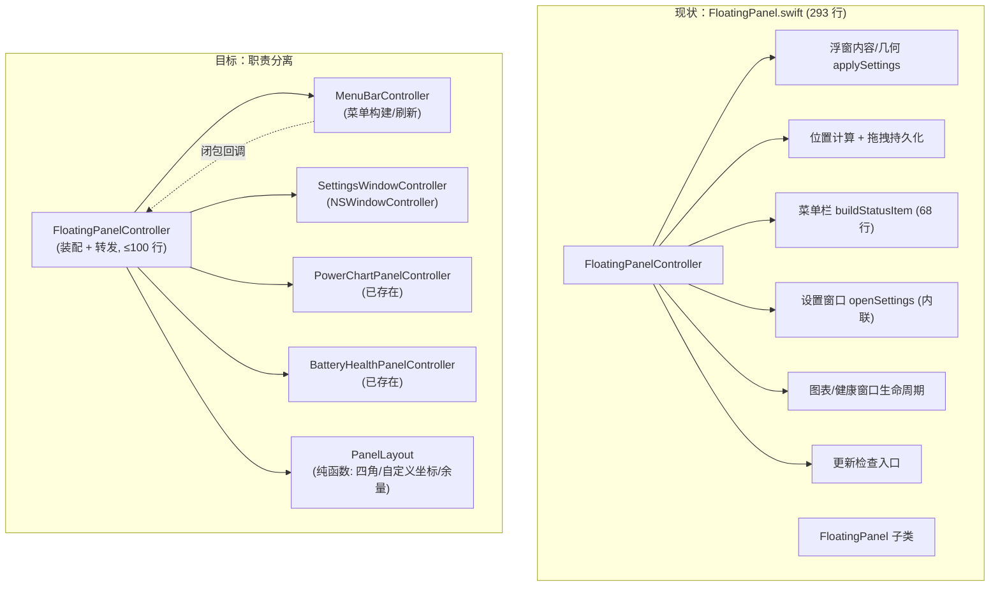
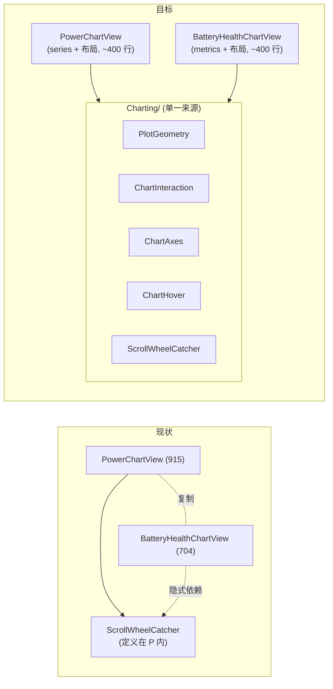

# MacBattery 系统架构评审报告

- **评审人**：高见远（架构师）
- **评审对象**：MacBattery（SwiftUI + SwiftPM，macOS 12+，v1.1.10，分支 `workbuddy/main-247e6f68`）
- **评审方式**：**只读静态代码阅读**。当前环境为 Windows，**未执行 `swift build` / 未运行任何测试**，所有结论均来自源码与文档的静态分析，涉及运行期行为的判断已明确标注为"推断"。
- **代码基线**：`Sources/MacBattery/` 16 个文件 + `Sources/MacBatteryHelper/` + `Sources/SMCBridge/`，约 4500 行。

---

## 一、总体判断

MacBattery 是一个**工程质量明显高于同规模个人项目**的成品：分层清晰（数据读取 / 采样中枢 / 持久化 / UI / 图表 / 更新各自成文件）、并发意图有明确注释、三级回退与多路兜底保证了"永远有值可显示"、CHANGELOG 记录到 1.1.10 且每条修复都指向具体行为。它已经稳定运行，**不需要推倒重来**。

但它的健康度是**"靠约定维持"而非"靠机制保证"**的健康：并发安全依赖一句注释（"只被后台串行队列调用"），而代码里已经存在**打破该注释的调用路径**（`PowerMonitor.scheduleSample()` 在主线程直接调用 `performSampling()`）；两个图表文件（915 + 704 行）是复制粘贴演化出的双胞胎，公共绘图基础设施只抽取了一半；同一份 SMC 候选键列表在三个地方各写一遍且已与文档不一致。

**主要矛盾**：**功能迭代速度 > 结构治理速度**。1.1.0→1.1.10 的 10 个版本几乎全在修"行为正确性"（充电判定、曲线静止、落盘覆盖），架构债被持续推迟，但其中若干条（如 v1.1.9 的"回填覆盖"）正是**结构缺陷导致的行为 bug**，而非业务逻辑错误。

**最该先动的地方（按顺序）**：① 把 `performSampling()` 的调用路径收敛回单一后台串行队列（消除主线程跑子进程 / 静态缓存并发访问）；② 抽取两个图表的公共绘图基础设施；③ 拆分 `FloatingPanel.swift` 的多重职责。其余（版本号双处维护、TDP 外置、签名）属于工程化收尾。

---

## 二、问题清单（按主题分级）

> 每条意见的四个要素：**问题定位（文件:行号）→ 影响 → 具体改法 → 优先级**。
> 优先级含义：**P0 = 阻断 / 应尽快修**（存在正确性风险或明确反模式）；**P1 = 应当做**（维护成本已可感知）；**P2 = 可选**（锦上添花，或有合理理由不做）。

---

### 主题 1：分层与职责边界

#### 1.1【必须改】`FloatingPanel.swift` 承担了 5 类互不相关的职责

- **问题定位**：`Sources/MacBattery/FloatingPanel.swift:1-293`。单个文件内包含：
  - 浮窗内容与几何应用 `applySettings()` L70-88、`positionPanel()` L90-118、`observeWindowMove()` L120-131；
  - 自定义位置持久化的旁路逻辑（拖拽写入 UserDefaults，L76-84 在 `AppSettings.swift`，但触发点在 L120-131）；
  - 菜单栏构建 `buildStatusItem()` L135-202（含位置/大小子菜单、穿透开关、更新、退出）；
  - 设置窗口生命周期 `openSettings()` L204-221（内联创建 `NSWindow` + 高度计算 + 复用判断）；
  - 图表 / 健康窗口生命周期 `openChart()` L223-230、`openHealthChart()` L232-240；
  - 更新检查入口 L262-264。
  - 附加：`FloatingPanel` 子类 L277-293 也挂在同一文件。
- **影响**：
  - 任何一处改动（如新增一个菜单项、改一次窗口尺寸）都要在一个 293 行的 `NSWindowController` 里定位，改动面与理解成本随菜单项线性增长；
  - `rebuildMenuCheckmarks()` L270-272 **直接重建整个菜单**（调用 `buildStatusItem()` 重新 `statusItem.menu = menu`），每次切换穿透/大小/位置都要重建全部菜单对象——功能上可行，但把"菜单项状态更新"和"菜单重建"两个概念混在了一个方法里；
  - 设置窗口的尺寸/复用策略与图表窗口的 `makeIfNeeded` 模式写法不统一（一个内联、一个静态工厂），新人难以判断该学哪种。
- **具体改法**（拆分，非重写）：
  1. 抽出 `MenuBarController`（`Sources/MacBattery/MenuBarController.swift`）：持有 `NSStatusItem`，暴露 `build()` / `refresh()`，通过一个轻量 `delegate`/闭包回调解耦动作，不直接引用 `NSWindow`。
  2. 抽出 `PanelLayout`（纯计算结构体）：把 `positionPanel` 的四角 + 自定义坐标 + `glowMargin` 扣减算法变成**无副作用纯函数**，便于单测（见主题 6）。
  3. 抽出 `SettingsWindowController: NSWindowController`，与已有的 `PowerChartPanelController` / `BatteryHealthPanelController` 统一为"`makeIfNeeded` 工厂 + 复用"模式。
  4. `FloatingPanelController` 只保留：持有各子控制器、转发菜单动作、应用设置。目标 ≤ 100 行。
- **优先级**：**P1**（P0 不成立：当前能正常工作；但它是所有后续 UI 改动的成本放大器）
- **不改的实际后果**：每加一个菜单项/窗口，`FloatingPanel.swift` 继续膨胀；`observeWindowMove` 与 `applySettings` 的隐式耦合（拖拽写坐标 ↔ 重新布局读坐标）会在某次改动中被打破，重现"拖动时窗口跳回角落"这类只在特定顺序下才出现的 bug——本项目历史上已多次出现这类"交互时序 bug"（见 CHANGELOG 1.0.9 / 1.1.1）。

**现状 → 目标（Mermaid）**



#### 1.2【可以不改，建议小改】`SystemPower.swift` 同时负责整机功率与 CPU / 内存

- **问题定位**：`Sources/MacBattery/SystemPower.swift:10-21`（整机功率三级回退）、`:24-44`（内存）、`:58-96`（CPU tick 差分）。
- **影响**：文件仅 96 行，职责虽杂但规模很小；真正的隐患不是"文件里有两个概念"，而是**状态耦合**——`lastCpuTicks`（L58）状态被 `watts()` 的估算路径隐式依赖（L17 `usage ?? cpuUsage()`），导致"CPU 采样频率"和"整机功率估算精度"被绑死。若将来把 CPU 采样降频（省电），整机功率估算会一并变差，而这一点从代码上看不出来。
- **具体改法**：**不拆分文件**（收益 < 成本），只做一件事——让估算公式**显式接收 usage**，删掉 `usage ?? cpuUsage()` 的隐式回退（L17），强制调用方传参；`Sampler.sample()` 已经先算好了 `u`（`PowerMonitor.swift:33`）并传入（L36），这条隐式路径当前其实是死代码，删掉即消除隐患。
- **优先级**：**P2**
- **不改的实际后果**：几乎为零（当前调用方总是传 usage）。仅保留一个"看起来能用、实际没被走到的"分支，增加阅读负担。

#### 1.3【可以不改】`AppVersion` 放在 `Updater.swift` 内

- **问题定位**：`Sources/MacBattery/Updater.swift:9-20`（`AppVersion`）、`:22-59`（`UpdateState`）、`:62-79`（`VersionCompare`）、`:86-247`（`UpdateChecker`）。
- **影响**：`AppVersion` 被 `SettingsView.swift:52` 和 `Updater.swift` 同时使用，是**跨模块的公共常量**，却定义在更新器的文件里；`VersionCompare` 是纯函数、`UpdateState` 是纯状态机，与被 `@MainActor` + `URLSession` + `NSAlert` 污染的 `UpdateChecker` 混在一起。
- **具体改法**：把 `AppVersion` 移到独立 `Version.swift`（或 `AppSettings.swift`），把 `VersionCompare` 一并移入；`Updater.swift` 只留 `UpdateChecker` + `UpdateState`。收益是 `VersionCompare` 立刻变成可单测的纯函数（见主题 6）。
- **优先级**：**P2**
- **不改的实际后果**：无功能影响；仅在"版本号"这个概念需要被第三处引用（如关于窗口、崩溃日志）时，引用路径会变得别扭。

#### 1.4【必须改】面板位置存在**两个状态源**（程序化布局 vs 用户拖拽），预设角会被静默改写成"自定义位置"

- **问题定位**：`Sources/MacBattery/FloatingPanel.swift:87`（`applySettings()` 调 `positionPanel(panel)`）→ `:117`（`panel.setFrameOrigin(origin)`）；与 `:120-131`（`observeWindowMove` 监听 `NSWindow.didMoveNotification` → `settings.rememberDrag(...)`，后者在 `AppSettings.swift:76-84` 把 `hasCustom = true`）。触发链：`:242-247` 的 `chooseCorner()` 先置 `hasCustom = false` 再 `commit()` → `onChange` → `applySettings()` → `positionPanel()` → `setFrameOrigin()` → `didMoveNotification` → `rememberDrag()` **把 `hasCustom` 又改回 `true`**。
- **影响（架构级：状态所有权不清）**：
  - **单一真相源被破坏**：`hasCustom` 的语义是"用户是否手工拖动过"，但**程序化定位（选角落、改尺寸）也会置位它**。
  - **投递语义分析（经与 QA 交叉核对后补入，关键前提）**：`observeWindowMove` 以 `queue: .main` 注册（`FloatingPanel.swift:121-125`）。块式观察者注册到**非 nil 队列**时，回调是**投递到该队列**执行（`OperationQueue.main` 排队），**不会在 post 栈内内联重入** —— 因此无论 AppKit 对程序化 `setFrameOrigin` 是**同步还是异步** post，到达 `rememberDrag` 时 `applySettings()` **已返回**，是"后一拍"发生。又因 `rememberDrag`（`AppSettings.swift:76-84`）**只写字段与 UserDefaults、不调用 `commit()`/`onChange`**（已核实），故**不会重入** `applySettings()`——QA 担心的"同步重入"在当前代码下**不成立**（但若将来有人给 `rememberDrag` 加上 `commit()`，重入风险立刻变为现实）。
  - **由此得到的持久可感知后果**：① 选角落后打开设置面板会显示"已在自定义位置"（`SettingsView.swift:24-28`），与实际意图不符；② **角落锚定丢失**——之后**修改尺寸**（`chooseSize()`）或**更换分辨率 / 显示器**时，窗口不再重新贴角，而是停在旧的自定义坐标；③ 菜单勾选是否"丢"取决于重建时序：`chooseCorner` 在 `setFrameOrigin` 后**同步**调 `rebuildMenuCheckmarks()`（`:246`），彼时 `hasCustom` 仍为 `false` → 勾选**当场正确**，但已与真实状态脱节，**下次重建才暴露**。故原稿"勾选立刻全丢"表述不准确，已按此修正。
  - 这不是孤例，而是 1.1 节所述"`FloatingPanel` 职责混杂"的直接产物：窗口几何、UserDefaults 持久化、通知监听三件事挤在一个控制器里，无法区分"我移动的"与"用户移动的"。
- **具体改法（按"免疫时序"优先级排序）**：
  1. **首选——值比较（确定性、免疫同步/异步差异）**：`positionPanel` 应用程序化原点时，把目标原点记入 `lastProgrammaticOrigin`；`observeWindowMove` 回调里若观测到的原点**等于** `lastProgrammaticOrigin`，则**忽略**该次 `didMove`，不写 `hasCustom`。判据是**值**而非"标志位何时清零"，故不受投递时机影响。**此写法必须写明两点语义，否则会被实现错**：
     - **容差**：用 **≤0.5pt** 比较（避免浮点/缩放取整误差导致漏判）；
     - **清空语义**：在程序化移动后的**第一次 `didMove` 上无条件清空**（命中则忽略并清空；未命中则清空并正常记录），把抑制窗口**严格限制为一条通知**。若采用"仅在命中时清空"，则一旦"程序化 `setFrameOrigin` **不** post"，该值将**永久残留**，后续某次用户拖拽恰好落回同一原点时会被**误吞**——故不取此语义。
     - **已知边界（须写进注释）**：若"用户拖拽恰好停在程序化原点 ±0.5pt 内"，该次会被吞（概率极低、且**自恢复**：下一次拖动即正常记录）。
  2. **配套（把"几条通知"从不确定变为确定 1 条，建议一并做）**：`applySettings()`（`FloatingPanel.swift:70-88`）当前**分两步**改窗口——`:82` `setContentSize()` 与（经 `positionPanel`）`:117` `setFrameOrigin()`；改为**先算好最终 frame（尺寸 + 原点），再单次 `setFrame(_:display:)`**。
     - **措辞精确（采纳 QA 修正）**：`setContentSize()` 在**原点不变**时更可能发 `didResize` 而非 `didMove`，故"当前真的发两条 `didMove`"**未必发生**——本条的收益应表述为"把'一次程序化移动发几条通知'从**不确定**变为**确定 1 条**"，**而非**"消除已存在的多条通知"（后者需真机数据支持）。如此既让"第一次即清空"的语义安全，又不会让作者误以为在修一个已复现的问题。
     - **附带收益（较前者更实在，采纳 QA 补充）**：现状"先 `setContentSize`（旧原点 + 新尺寸）→ 再 `setFrameOrigin`"存在一个**中间态**：尺寸已变而原点未随。对**角落锚定**的挂件，这一瞬间会几何偏离角落（推断可能闪现 / 抖动）。合并为单次 `setFrame` 后**中间态消失**。
     - **验收要求（采纳 QA 底线）**：1.4 改完后，**定位几何必须能脱离 AppKit 单测**——把四角定位抽成纯函数（如 `originFor(corner:visibleFrame:size:margin:) -> NSPoint`），用例覆盖 **四角 × `scale ∈ {0.8, 1.0, 1.3}` × `margin` 正/负号**。否则这次修复**没有任何回归保护**，而 1.4 恰是"位置"这一用户高频操作，下次重构必再翻车。此项与 6.1 的纯函数化、1.1 的 `PanelLayout` 抽取**三处合并为同一件事**。
  3. **并列首选（结构性）**：把"位置"收敛为**单一真相源** `PanelPosition` 枚举（`.corner(Corner)` / `.custom(x, y)`），替代 `hasCustom` + `cornerRaw` + `customX` + `customY` 四个松散字段；只有**用户拖拽**才产生 `.custom`。注意：枚举消除的是**状态散落**，**不能**单独解决"这次移动是谁发起的"（`didMove` 通知**不含来源信息**）——**必须配合第 1 点的值判据**（或一个显式来源标记）才成立，**不可单独作为修法**。
  4. **次选（不推荐单独使用）**：`isProgrammaticMove` 抑制标志 + `DispatchQueue.main.async { 清标志 }`。它**依赖投递时序**（观察者块与清零块同排主队列，先后无保证），仅作第 1 点的补充。
  5. 结合 1.1，把该逻辑移入 `PanelLayout`（纯计算）+ `SettingsStore`（单一持久化），控制器只做调用。
- **验证前提（务必真机确认，两项）**：
  - **（i）**「AppKit 对**程序化** `setFrameOrigin` 会 post `NSWindowDidMoveNotification`」——**Apple 文档未作契约保证**，社区经验是"通常会 post 但非保证"。若确认**不会** post，则本条影响不成立（降 P2，仅保留状态建模价值）。
  - **（ii）** `applySettings()` 路径中 `setContentSize` + `setFrameOrigin` **共发出几条** `didMoveNotification`——这直接决定"第一次即清空"是否安全（若合并为单次 `setFrame`，该风险大幅下降）。
  - **在确认前，本条"影响"应表述为"高度可疑（机制清晰、证据为静态推断）"，不宜表述为"已复现"。**
  - **★ 关键：第 1 点的值比较修法在"会 post"与"不会 post"两种情况下都安全**（不 post 时它只是永不触发、无副作用），故**可先落地、无害——不要因"待验证"而整条搁置**。
- **优先级**：**P1**（若真机确认"程序化 `setFrameOrigin` 会 post"，则升为 P1 中优先项；若确认"不会 post"，本条降为 P2 并仅保留"状态建模"价值）
- **不改的实际后果**：角落预设对用户表现为"选一次就固化成坐标"——改尺寸 / 换显示器后不再贴角，且设置面板长期误报"自定义位置"。这是一种"看起来纯 UI、根因在状态建模"的问题；继续在 `FloatingPanel` 里加逻辑，同类冲突会不断复现。

#### 1.5【应当做】`FloatingPanelController.deinit` 的清理逻辑**永不执行**（所有权/生命周期设计问题）

- **问题定位**：`Sources/MacBattery/FloatingPanel.swift:57-65`：
  ```swift
  deinit {
      if let observer = moveObserver { NotificationCenter.default.removeObserver(observer) }
      Task { @MainActor [weak self] in
          self?.monitor.stop()
          self?.healthLogger.stop()
      }
  }
  ```
  在 `deinit` 中捕获 `[weak self]`：对象正在析构，Task 稍后执行时 `self` 必为 `nil`，**`monitor.stop()` / `healthLogger.stop()` 永远不会被调用**。
- **影响**：`monitor.stop()` 负责取消 `DispatchSourceTimer`（`PowerMonitor.swift:93`）与从主 RunLoop 移除 `IOPS` 通知源（`:96-99`）；`healthLogger.stop()` 负责 `Timer.invalidate()`。这些资源在控制器释放后**不会回收**。推断：`AppDelegate`（`main.swift:13`）**强持有** `windowController`，正常退出走 `NSApp.terminate`，所以 `deinit` 实际极少触发——**当前运行期影响很小**。但它是明确的**所有权设计缺陷**：清理责任被放在一个"永远不会执行"的位置，等于**没有清理路径**。
- **具体改法**：不要把 `stop()` 绑在 `deinit` 上。改为：
  1. 由 `AppDelegate.applicationWillTerminate`（`main.swift:21-23`）显式调用停止（当前只调了 `windowController?.close()`）；
  2. 或让 `deinit` **强引用**所需的停表闭包（`let stopMonitor: () -> Void`），不依赖 `self`；
  3. `stop()` 本身做成幂等（`start()`/`stop()` 可重入），这样无论从哪条路径调用都安全。
- **优先级**：**P2**（当前 `AppDelegate` 强持有 → 实际泄漏概率低；但属"架构正确性"问题，修法简单）
- **不改的实际后果**：低。仅在将来引入"多窗口 / 可热插拔控制器 / 预发时销毁"等改动时，才会表现为"后台定时器与 RunLoop source 泄漏、应用无法干净退出"。**建议在 1.1 的控制器拆分时顺手修正**，不必单独排期。

#### 1.6【可以不改，建议随 1.1 顺手做】`applySettings()` 每次重建整棵 HUD 视图树 + 两处"危险死代码"（QA 编号 P2-19 / P2-20）

- **问题定位（一）HUD 视图树无谓重建（P2-19）**：`FloatingPanel.swift:77` + `:81` —— `applySettings()` **每次**都 `NSHostingView(rootView: PowerHUDView(monitor: monitor, scale: scale))` 并整树替换 `panel.contentView`；而 `applySettings()` 由 `settings.onChange`（`:43`）触发，`onChange` 由 `SettingsStore.commit()`（`AppSettings.swift:64`）触发，`commit()` 又在**每一个**设置项的 `onChange` 里被调用（`SettingsView.swift:78-81`）。
- **影响**：**TDP 滑块拖动**（`SettingsView.swift:39` + `:81`）与**鼠标穿透开关**（`:80`）都会走 `commit → onChange → applySettings → 重建 HUD 视图树`，但两者**都不参与 `PowerHUDView` 的构造**（其参数仅 `monitor` + `scale`，`PowerHUDView.swift:10-12`）。推断：拖动 TDP 滑块时**每次提交都重建一棵 SwiftUI 视图树 + NSHostingView**，是"用整树替换实现单一字段变更"的浪费——1.1 职责混杂的又一实例。
- **具体改法**：`applySettings()` 拆成"**结构性变更**（size/scale → 重建 hosting）"与"**非结构性变更**（passthrough → 仅设 `panel.ignoresMouseEvents`/`isMovableByWindowBackground`；位置 → 仅 `positionPanel`）"两条路径；**TDP 变更根本不需要调用 `applySettings`**（它只影响采样输入，`PowerMonitor` 每拍已从 `SettingsStore` 读最新 TDP）。与 1.1 的拆分同一次完成。
- **问题定位（二）两处"危险死代码"（P2-20）**：`PowerMonitor.refreshOnce()`（`PowerMonitor.swift:103-105`）与 `SettingsStore.saveCustomPosition()`（`AppSettings.swift:68-73`）**全仓无调用点**（已 grep 核实，仅剩定义）。
- **影响**：二者恰是各自功能里的"**危险版本**"——`saveCustomPosition` 会调 `commit()`（`:72`）从而触发 re-layout，而**实际在用的** `rememberDrag`（`:76-84`）**刻意不调** `commit()`（正是 1.4 分析所依赖的性质）；`refreshOnce()` 会**同步**在主线程触发一次采样（正是 2.1 的问题形态）。**死代码本身不危险，危险的是它诱使后来者"接线"**——若有人为"改设置立即刷新"而调用 `refreshOnce()`，就亲手把 2.1 的主线程采样重新引入。
- **具体改法**：**删除**这两处（推荐），或至少加注释「⚠️ 勿直接接线：会在主线程同步采样 / 会触发 re-layout」。随 1.1 拆分一并处理最经济。
- **优先级**：**P2**（功能无影响；但对接手维护者是"少一个坑"）
- **不改的实际后果**：TDP/穿透操作带来无谓视图重建（推断为轻微卡顿，与 2.1 叠加时更明显）；死代码作为"错误示范"留存，可能被后来者误接线而**重新引入 P0 的主线程采样**。

---

### 主题 2：并发模型（**本报告最高优先级主题**）

#### 2.1【必须改，P0】`performSampling()` 会被主线程直接调用，打破"仅后台串行队列"的约定

- **问题定位**：`Sources/MacBattery/PowerMonitor.swift:127`（`private nonisolated func performSampling()`）的**两个调用点**：
  - L115 `src.setEventHandler { [weak self] in self?.performSampling() }` —— 在 `sampleQueue` 上执行 ✅；
  - L123 `scheduleSample()` 内**直接**调用 `performSampling()` —— 而 `scheduleSample()` 是 `@MainActor` 类的方法（L121），**在调用线程（主线程）上同步执行**。
  - 而 `scheduleSample()` 的**可达**调用者：L89（`start()`，主线程）、L177（`powerSourceChanged()`，IOPS 回调，主 RunLoop = 主线程）。**（经与 QA 交叉核对修正）** L104 的 `refreshOnce()`（`PowerMonitor.swift:103-105`）**全仓无调用点，是死代码**，不应再计为入口——但 `start()` + `powerSourceChanged()` 两条已足以在**启动**与**每次插拔**触发主线程采样，**P0 定性与优先级不变**，仅描述更准。
  - **第二个主线程入口（经与 QA 交叉核对补入，`BatteryHealthLogger.swift:51-60`）**：`FloatingPanelController.init()` 在**主线程**调用 `healthLogger.start()`（`FloatingPanel.swift:42`），其 `:59` 同步执行 `sample(force: true)` → `BatteryReader.health()`（`BatteryHealthLogger.swift:87`）→ `currentService()`（`Battery.swift:109`）→ `IOServiceGetMatchingService`。这条路径**完全绕开 `PowerMonitor`**，同样在无锁读写 `BatteryReader` 的静态缓存。即"主线程访问硬件缓存"至少有**两条独立来源**。
  - 文件顶部注释 L6-7 明确声明"所有读取均为 nonisolated，且**只被后台串行采样队列调用**，因此静态缓存无需额外加锁"——**该前提在 L123 与 `BatteryHealthLogger.start()` 两处均已被破坏**。
  - 附带：`FloatingPanelController.init()`（`FloatingPanel.swift:40-42`）在**主线程**连续调用 `monitor.start()` + `healthLogger.start()`，即应用启动瞬间就在主线程做 SMC / IOKit 硬件读取与子进程拉起——这属于"把 I/O 密集的启动逻辑放在最敏感的主线程"。**架构级修法**：`monitor.start()` / `healthLogger.start()` 内部的第一步采样改为异步投递到各自的后台队列，`start()` 立即返回。
- **影响（两层，均属正确性风险）**：
  1. **主线程被阻塞在子进程上**：主线程路径 `performSampling → Sampler.sample → BatteryReader.chargingStatus → pmsetBatteryStatus` 会执行 `process.waitUntilExit()`（`Battery.swift:159`），即**在主线程上同步等待 `pmset -g batt` 子进程结束**。这个路径恰好在"插拔电源时"触发（L175-178）——正是用户最需要界面即时响应的时刻。推断：会造成数十毫秒级的主线程卡顿，表现为挂件画面短暂冻结 / 拖拽迟滞。
  2. **静态缓存并发访问**：`SMCReader.conn` / `effectiveKey`（`SMC.swift:21,23`）、`BatteryReader.cachedService`（`Battery.swift:10`）、`SystemPower.lastCpuTicks`（`SystemPower.swift:58`）均**无锁**。当主线程与 `sampleQueue` 同时进入 `Sampler.sample()`（例如 `start()` 的主线程采样尚未结束、0.5s 后定时器在后台队列触发；或设置改动触发 `refreshOnce()` 与后台 tick 相撞），会出现两个线程并发读写同一 `io_connect_t` / 句柄 / `effectiveKey`。推断风险：`SMCReader.systemWatts()` 中两个线程同时看到 `conn == 0` 而各自 `SMCOpen()`，泄漏一个连接；`Battery.swift:53-61` 的"重建句柄"分支并发执行时 `IOObjectRelease` 与 `SMCGetFloatValue` 交叉，可能读到已释放句柄。
- **具体改法（最小、可靠）**：**让 `performSampling()` 只有一个入口——后台串行队列**。把三个"主线程入口"改为**投递**而非同步执行：
  ```swift
  // scheduleSample(): 主线程只更新 TDP 并投递，不再同步采样
  private func scheduleSample() {
      tdpBox.withLock { $0 = settings.tdpWatts }   // 或 actor 化
      sampleQueue.async { [weak self] in self?.performSampling() }
  }
  ```
  这样：① 主线程永不进入 `Sampler.sample()`，pmset / SMC / IOKit 全部只在后台串行队列发生，注释 L6-7 的约定**重新成立**；② 采样仍保证串行，静态缓存无需加锁的前提恢复有效；③ 电源事件仍能"立即补一次采样"（只是异步，延迟以微秒计，不影响 1.1.10 里"≤0.5s 感知"的目标）。
  - 若要更进一步（推荐但非必需）：给 `sampleQueue` 加一个"合并投递"标记，避免同一拍重复投递。
- **优先级**：**P0**
- **不改的实际后果**：主线程在插拔/启动/改设置时被 `pmset` 子进程阻塞（可感的 UI 卡顿）；且随功能增加，任何新增的"主线程触发采样"入口都会**静默扩大**静态缓存的并发窗口。这类竞态不会稳定复现——正是它危险的原因：一旦在用户机器上出现"偶发显示 0 / 偶发句柄失效"，几乎无法从日志定位。

#### 2.2【必须改】`TDPBox` 用裸 `var` 跨线程读写

- **问题定位**：`Sources/MacBattery/PowerMonitor.swift:183-189`（`private final class TDPBox { var value: Double }`），写入点 L122（主线程）、L132（`Task { @MainActor }`，主线程），读取点 L128（后台）。注释 L74、L182 称"值为 Double，竞争可忽略"。
- **影响**：按 Swift 内存模型这是**数据竞争（UB）**，不是"可忽略"。在本项目目标架构（x86_64 / arm64，8 字节对齐）上**几乎不会**出现撕裂值（torn read），所以运行期大概率无感——但：① Thread Sanitizer / Swift 6 严格并发检查会直接报错；② 它把"跨线程共享状态"这一模式**合法化**了，诱使后来者继续用裸 `var` 传状态（`BatteryReader.lastEventRefTime` L14 已经是照抄它的第二个例子）。
- **具体改法**：二选一。
  - **首选**：`TDPBox` 改为 `@MainActor final class`，把 `performSampling()` 里对 TDP 的读取也改为"在后台采样前、于 `sampleQueue.async` 的闭包外捕获一份快照"——即把 TDP 通过**值传递**（capture）而非共享内存送入后台，彻底去掉共享可变状态。
  - **次选**（改动更小）：用 `OSAllocatedUnfairLock<Double>`（macOS 13+）或 `os_unfair_lock` 包裹，或改用 `Mutex<Double>`（Swift 5.9+）。注意项目目标 macOS 12，`OSAllocatedUnfairLock` 需条件编译或改用 `NSLock`。
  - 同理处理 `BatteryReader.lastEventRefTime`（L14）：改为 `OSAtomic`/`NSLock` 保护，或干脆改为"在主线程把事件时间作为参数传下去"（与 TDP 同一思路）。
- **优先级**：**P1**（若采纳 2.1 的"仅后台队列单入口"方案，则 TDP 的读写重新回到 `sampleQueue` 串行 + 主线程写入的**双写单读**形态，仍需处理，但风险窗口大幅收窄）
- **不改的实际后果**：长期看是"技术债的示范样本"——每多一个共享可变状态就多一处未定义行为；中期看，若将来接入 Swift 6 语言模式或开启 TSan 门禁，会一次性爆出大量告警。

#### 2.3【必须改】`PowerLogger.backfillHistory()` 仍会用磁盘历史整体覆盖内存新采样（v1.1.9 同类缺陷的遗留）

- **问题定位**：`Sources/MacBattery/PowerLogger.swift:88-97`，关键行 **L94 `self.samples = history`**。对比 `BatteryHealthLogger.swift:121-133`（v1.1.9 已修复为 `merge(history:new:)`，`generate` 校验 + 合并去重）。
- **影响**：`start()`（L49-55）先 `backfillHistory()`（L50，异步读盘），随后 `PowerMonitor.start()` 立即 `scheduleSample()` 写入若干新点到内存（`PowerMonitor.swift:85-89`）。异步回填返回后执行 `self.samples = history`，**把这一小段（约 1～2 秒）新采样从内存里抹掉**。推断：数据不会永久丢失（`pending` 已把新点送往磁盘，L75/L84），但内存曲线在启动瞬间会丢掉最近 1～2 秒，且**与健康日志的行为不一致**——同类问题在 `BatteryHealthLogger` 已经踩过坑并修过（CHANGELOG 1.1.9），说明这是本项目反复出现的模式。
- **具体改法**：把 `BatteryHealthLogger.merge(history:new:)`（L138-152）推广为一个**共用的 `SampleMerge` 工具**（或 `Sequence` 扩展 `mergeDedupByTimestamp`），两个 Logger 复用；`PowerLogger.backfillHistory()` 改为 `self.samples = merge(history, self.samples)`。
- **优先级**：**P1**
- **不改的实际后果**：启动瞬间的历史曲线可能出现一个"缺口"或回退；在"用户刚启动就看 24h 图"的场景下可见。更重要的是**同类缺陷会第三次出现**——只要这两个 Logger 继续各写各的回填逻辑。

#### 2.4【可以不改，需加护栏】"靠注释约束并发安全"的整体模式

- **问题定位**：`PowerMonitor.swift:6-7`、`SMC.swift:8`、`Battery.swift:6`、`Battery.swift:140`、`SystemPower.swift` 等处的注释，全文共 4 处以"只被后台串行队列调用，所以无需加锁"为依据免除同步。
- **影响**：注释不是编译器能校验的契约。**2.1 已经证明该契约可被一行普通代码破坏**。
- **具体改法**：**不全量 actor 化**（成本过高、收益不匹配），而是给这些"缓存型枚举"加**编译期护栏**：把它们从 `enum + static var` 改为 `struct` 实例（如 `SMCReader` 变为 `PowerMonitor` 持有的一个实例），实例只在 `sampleQueue` 上被触碰；再用一个轻量断言（`dispatchPrecondition(condition: .onQueue(sampleQueue))`）在 `Sampler.sample()` 入口校验"必须不在主线程"（`dispatchPrecondition(condition: .notOnQueue(.main))`）。这样"约定"变成"运行时断言"，违约即刻崩溃并暴露，而不是静默竞态。
- **优先级**：**P2**（在 2.1 落地后，风险已大幅下降；断言作为"防回归"手段值得加）
- **不改的实际后果**：约束继续只存在于注释里，下一次重构（尤其是一个新人/新 AI 接手时）仍可能无意打破。

---

### 主题 3：外部依赖与容错

#### 3.1【必须改（配合 2.1）】对 `pmset -g batt` 子进程的依赖

- **问题定位**：`Sources/MacBattery/Battery.swift:144-174`，尤其 L148-159（`Process` + `Pipe` + `waitUntilExit()`）。
- **影响（多面）**：
  1. **能耗 / 开销**：缓存 2 秒（L146），采样 0.5s（`PowerMonitor.swift:78`）→ 稳态下**约每 2 秒拉起一个 `pmset` 进程**（≈30 次/分钟）。这是一款以"轻量常驻"为卖点的挂件，进程拉起的中断 / fork 开销在笔记本上对电池续航是负面的——**在一个"电池工具"里为读电池状态而额外耗电，是产品逻辑上的自我矛盾**。
  2. **主线程阻塞**：见 2.1，`waitUntilExit()` 的同步等待会落到主线程上（当前）。
  3. **沙盒化 / App Store**：`Process` 拉起 `/usr/bin/pmset` 在 **App Sandbox 下会被直接禁止**（无法 `fork/exec` 任意路径），且 `pmset` 不在沙盒白名单。当前项目未上沙盒 / 未上 App Store，所以能跑；**一旦想上架 Mac App Store，这条路径必须整体移除**。
  4. **未来 macOS 风险**：解析 `pmset` 的**人类可读英文文本**（`output.contains("AC Power")` L164、`"charging"` L167、`"finishing charge"` L168）属于**脆弱的非结构化契约**。推断：若某 macOS 版本改变 `pmset` 措辞、或系统语言影响输出，判定会静默失效。这与项目"零第三方依赖、只依赖系统接口"的自我定位相悖——它依赖的不是 API，而是**命令行文本格式**。
- **具体改法（分两步，尊重现有取舍）**：
  - **第一步（低成本，必做）**：把 `pmset` 调用**移出主线程**（随 2.1 一起自然解决，因为所有采样都回后台），并**把缓存时长从 2s 提高**（如 5s），把次数降到 ~12 次/分钟；同时把 `pmsetBatteryStatus()` 的调用改为**非阻塞**（`terminationHandler` + 首次返回上次缓存），避免任何线程被 `waitUntilExit` 卡住。
  - **第二步（中期，需回归验证）**：用纯 API 组合**替代**子进程作为权威判定路径。分析现有代码可发现，IOPS 路径其实已经具备判定能力：
    - `kIOPSIsChargingKey`（已用，`Battery.swift:178-190`）——与系统菜单栏同源；
    - `kIOPSPowerSourceStateKey`（等于 `kIOPSACPowerValue` 判断是否接电）——可替代 L164 的 `"AC Power"` 字符串匹配；
    - `IOPSGetTimeRemainingEstimate` / `kIOPSTimeToFullChargeKey`——可辅助区分"充电 / 充满"。
    **为什么现在选了子进程**（我的推断，需向作者确认，见"待明确事项"）：CHANGELOG 1.1.0→1.1.10 显示作者在 IOPS / `IsCharging` / 电流方向三条路径间反复摇摆（1.1.0 用 IOPS、1.1.7 改用 pmset 为权威），说明 IOPS 的 `kIOPSIsChargingKey` 在某些机型/时刻存在**滞后或缺失**，作者遂引入 `pmset` 作为"文本权威"。因此**替代方案必须先在目标机型上验证**，不能纯靠代码推断直接替换。
  - **替代路径的落地形态**：把"充电判定"抽象为一个 `protocol ChargingStatusProvider`，提供 `PMsetProvider`（现状）与 `IOPSProvider`（新）两个实现，用设置或运行时探测选择，**保留回退**。这样即使未来移除 pmset，行为可平滑过渡。
- **优先级**：**P1**（第一步 P1、第二步 P2——第二步有回归风险，需实机验证）
- **不改的实际后果**：**留在当前形态的直接后果是"永久无法上 App Store 沙盒"**，且产品持续以"每 2 秒 fork 一个进程"的方式消耗它所监测的电池；此外 `pmset` 文本契约的脆弱性会在未来某个 macOS 版本上变成一次"充电状态永远显示错误"的线上事故，且**从代码里看不出这是外部依赖变更导致的**。

#### 3.2【可以不改】整机功率的"写 `/tmp` JSON"进程间通信

- **问题定位**：`Sources/MacBatteryHelper/main.swift:42-52`（写 `/tmp/macbattery_power.json` + `chmod 0644`）、`Sources/MacBattery/SystemPower.swift:47-54`（读该文件）。
- **影响**：用**全局可读的 `/tmp` 文件**做 root→用户态的数据传递，属于弱 IPC：① `/tmp` 在 macOS 上虽然是每用户私有 `/private/tmp` 的符号链接，但 `/tmp/macbattery_power.json` 是**固定路径**，存在被其他本地进程**预置伪造值**的可能（影响面：仅显示一个错误瓦数，无提权，风险低）；② 无原子写保证——`try payload.write(atomically: true)`（L45）已用原子写 ✅，读取侧 `Data(contentsOf:)` 可能短暂拿到空/半文件（推断：概率低）。
- **具体改法**：**低优先级**。若要加固：把 `/tmp` 换成 `~/Library/Application Support/MacBattery/`（同用户目录，非全局）或用 `NSFileCoordinator`；或改用 XPC / `SMJobBless` 的 Apple 官方提权模型（成本高得多）。当前"读不到就回退估算"（`SystemPower.swift:14-20`）已经容错，风险可接受。
- **优先级**：**P2**
- **不改的实际后果**：极小。仅在多用户机器或存在恶意本地进程时有理论影响。

---

### 主题 4：界面层——两个图表视图的可抽取公共基础设施

#### 4.1【必须改】`PowerChartView.swift`(915) 与 `BatteryHealthChartView.swift`(704) 的重复基础设施

- **问题定位**：逐项对照后确认**已复制粘贴**的公共逻辑：

  | 能力 | `PowerChartView.swift` | `BatteryHealthChartView.swift` | 状态 |
  |---|---|---|---|
  | 绘图区矩形 | `PlotRect` L538-554 | `HealthPlot` L473-491 | **重复**（后者多了分区高度） |
  | 拖拽平移 | `dragTranslation` L374-385 | L363-370 | **重复** |
  | 滚轮缩放/平移 | `handleScroll` L387-409 | L372-391 | **重复** |
  | 时间窗钳制 | `clampEnd` L434-440 | L415-421 | **重复**（阈值 12s/20s 完全相同） |
  | 时间轴刻度步长 | `niceTimeStep`(ChartDraw) L816-823 | L690-696 | **重复**（候选数组几乎一致） |
  | X 轴时间格式 | `xFormatter` L830-836 | L698-704 | **重复** |
  | 最近样本二分查找 | `nearestSample` L212-221 | L350-359 | **重复** |
  | 悬停浮层绘制 | `drawHover` L692-724 | L613-646 | **重复**（像素偏移 10/26/15 完全相同） |
  | 折线描边 | `stroke` L726-733 | L666-673 | **重复**（线宽 1.6、opacity 0.9 相同） |
  | 滚轮事件桥接 | `ScrollWheelCatcher`/`ScrollCatcherView` L843-898 | 引用同一类型 | **已共享** ✅（但定义在 `PowerChartView.swift` 里，位置不当） |
  | `niceStep` 刻度取整 | L904-916（`private`，文件级） | 无（健康图用固定的 0/0.5/1 三刻度） | 近似 |
- **影响**：
  - 任何图表交互类修复（如"拖拽 1:1 跟手"、"窗口失焦不闪退"——CHANGELOG 1.1.1 都修过）**都要改两遍**，且两处实现已出现轻微分叉（如健康图的 `setWindow` L209-214 缺少历史图的 `rightAxisInitialized` 复位）。
  - `ScrollWheelCatcher` 定义在 `PowerChartView.swift` 而**被健康图引用**（`BatteryHealthChartView.swift:246`），形成**隐式文件依赖**：删/改 `PowerChartView.swift` 会连累健康图。这是"复制粘贴演化"的典型症状——共享的东西没被正式抽出来，只是碰巧在一个文件里。
- **具体改法**：
  1. 新建 `Sources/MacBattery/Charting/` 目录，抽出：
     - `PlotGeometry.swift`：统一 `PlotRect`（支持可选分区高度，替代 `HealthPlot`）；
     - `ChartInteraction.swift`：拖拽平移 / 滚轮缩放 / 时间钳制 / 悬停定位，做成**与具体数据无关的控制器**（输入：时间范围 + 绘图区；输出：新的 `timeRange` / `endTime` / hover 状态）；
     - `ChartAxes.swift`：`niceStep` / `niceTimeStep` / `yTicks` / `timeTicks` / `xFormatter`（合并两个 `niceTimeStep`）；
     - `ChartHover.swift`：`HoverInfo` + `drawHover`（泛型化为"给定 rows 与 anchor 绘制"）；
     - `ScrollWheelCatcher.swift`：从 `PowerChartView.swift` 移出。
  2. `PowerChartView` / `BatteryHealthChartView` 只保留**各自的 series/metric 定义与布局差异**（这正是它们真正不同的地方）。
  3. 目标：两个文件回到 ~350-450 行，公共部分 ~250 行且**只此一份**。
- **优先级**：**P1**
- **不改的实际后果**：图表是**这个项目改动最频繁的区域**（CHANGELOG 里 1.0.9→1.1.10 有 8 条涉及图表），再次出现"主图修了、健康图没修"的行为不一致只是时间问题；而且两个 900 行级文件**无法被任何人完整读进工作记忆**，进一步推动"只敢改局部"的保守策略。

**现状 → 目标（Mermaid）**



---

### 主题 5：可配置性（硬编码外置）

#### 5.1【必须改】SMC 候选键列表在**三处**各写一份，且已与文档不一致

- **问题定位**：
  - `Sources/MacBattery/SMC.swift:12-18` → `["PSTR","PDTR","PCHC","PSYS","PWRS"]`
  - `Sources/MacBatteryHelper/main.swift:31` → `["PSTR","PDTR","PCHC","PSYS","PWRS"]`（**逐字重复**）
  - `README.md:90` → `PSTR、PDTR、PCHC、PWRS、EDR0`（**不同**：少 `PSYS`，多 `EDR0`）
- **影响**：这是**同一事实的三份拷贝，其中一份已经错**。主程序与 helper 的两个列表必须**始终一致**（否则会出现"装了 helper 反而读到不同键"的诡异现象）；文档的错误会误导维护者按 `EDR0` 去调试。
- **具体改法**：把候选键列表提升为**唯一来源**——由于 `MacBattery` 与 `MacBatteryHelper` 是两个 target，可放在它们共同依赖的 `SMCBridge` target 中（新增一个 `SMCKeys.h` 常量，或让 helper 复用 `SMC.swift` 内的定义——但 target 不同，需抽到一个共享位置）。最简做法：在 `SMCBridge` 暴露 `const char *SMC_POWER_KEYS[]`，两个 Swift target 都引用它。同步修正 README:90。
- **优先级**：**P1**
- **不改的实际后果**：未来增删一个候选键时，**极大概率只改一处**，导致 helper 与主程序行为分叉；文档继续误导。这属于"低成本、高确定性收益"的修复。

#### 5.2【应当做】TDP 默认值与估算公式常数硬编码

- **问题定位**：`Sources/MacBattery/AppSettings.swift:44`（默认 45）、`PowerMonitor.swift:186`（`TDPBox` 默认 45）、`SystemPower.swift:18-20`（公式 `tdp*(0.05+0.95*u) + (7+3*u)`，常数 0.05 / 0.95 / 7 / 3）。
- **影响**：TDP 默认 45W 对 Apple Silicon（读不到 SMC 时全靠估算）意义不大——Apple Silicon 的 TDP 语义与 Intel 完全不同，用同一个 45W 会让估算值系统性偏移。估算公式的 4 个常数是"面向某类 Intel 轻薄本拟合"的经验值，换机型即失真。
- **具体改法**：
  - TDP：默认值从"硬编码 45"改为**按机型推断**——用 `sysctl machdep.cpu.brand_string` / `hw.model` 查一张**内置机型表**（可先只覆盖常见型号，未命中回退 45），或至少把默认值改为"按芯片族分档"。
  - 估算公式：把常数抽到一处具名常量（`EstimateProfile.SoC` / `.IntelThin` 等），便于后续按档位切换；**不做复杂外置配置文件**（见 5.3）。
- **优先级**：**P1（TDP 默认值）** / **P2（估算公式常数）**
- **不改的实际后果**：Apple Silicon 用户（占新 Mac 绝大多数）看到的整机功率**长期是一个偏移的经验值**，而 UI 又没有任何"这是估算值"的提示（见 主题 8），会削弱工具可信度。

#### 5.3【可以不改】是否引入外部配置文件 / 机型表

- **问题定位**：（无具体行号，属设计取向）
- **影响**：外置 JSON/plist 配置文件需要处理"文件缺失→默认值""用户改坏→容错""随版本升级合并"三类问题，对一款单机小工具是**过度设计**。
- **具体改法**：**不做外部配置文件**；机型表作为**编译期常量**（Swift 数组/字典）即可，随版本发布更新——这符合项目"零第三方依赖、单二进制"的定位。
- **优先级**：**P2**
- **不改的实际后果**：无。保留当前"常量 + UserDefaults 让用户手调 TDP"的形态即可。**明确建议不引入配置文件。**

---

### 主题 6：可测试性

#### 6.1【应当做】当前代码几乎不可测——给出最小改造方案

- **问题定位**：
  - `Package.swift:9-25` **没有任何 test target**（已核实，无 `Tests/` 目录）。
  - 不可测的具体障碍：
    - `enum` + `static var` 缓存（`SMCReader` L21-23、`BatteryReader` L10/L14/L141-142、`SystemPower` L58）——全局单例状态，测试间互相污染，无法注入假数据；
    - 直接调用系统 API（`IOServiceGetMatchingService`、`IOConnectCallStructMethod`、`host_statistics64`、`Process`）——没有协议抽象层，无法 mock；
    - `Sampler.sample()`（`PowerMonitor.swift:22-38`）虽是 `static`，但内部全是对**静态函数**的直调，非纯函数；
    - UI 层（图表几何）逻辑与 `View` 结构体耦合，无法脱离 SwiftUI 运行。
- **具体改法（最小、可分步）**：
  1. **抽协议**：为三类读取定义最小协议——
     ```swift
     protocol BatteryReading { func level() -> Int; func chargingStatus() -> ChargingInfo; func health() -> BatteryHealth? }
     protocol SystemReading  { func cpuUsage() -> Double; func memoryUsage() -> Double; func watts(tdp: Double) -> Double }
     ```
     把 `BatteryReader` / `SystemPower` 改为这些协议的**默认实现**；`Sampler` 改为接收协议实例。
  2. **纯函数化**：`Sampler.sample(tdp:)` 改为 `Sampler.sample(tdp:using:)`，把"读 → 算 → 组 Frame"中的**‘算’部分**（如电压×电流→功率、TDP 估算公式）抽成**无副作用纯函数**，这是**收益最高、成本最低**的测试点。
  3. **几何纯函数化**：`PowerChartView` 里的 `niceViewport`（L319-340）、`refreshRightAxis`（L348-370，可拆出"给定 lo/hi/现状→新范围"的纯函数）、`visibleIndexRange`（L278-294）、`clampEnd`（L434-440）——这些是纯计算，抽成独立类型后**极易单测**，且正是历史上 bug 最多的区域（右轴跳动、曲线漂移）。
  4. **抽时间源**：`clampEnd` / `fitToAll` 直接用 `Date()`（如 L435、L452），改为注入 `Clock`（或 `now: () -> Date`），使时间相关逻辑可确定性测试。
  5. **加 target**：`Package.swift` 增加 `.testTarget(name: "MacBatteryTests", dependencies: ["MacBattery"])`。⚠️ 注意 `MacBattery` 是 `executableTarget`，**测试可执行 target 在 SwiftPM 里受限**（需把可测逻辑下沉到一个新的 `library` target，如 `MacBatteryCore`，让 `MacBattery` 与测试都依赖它）。这实际是一次**有益的架构调整**：把"逻辑"与"应用外壳 / AppKit 入口"分离。
- **优先级**：**P1**（"算"部分纯函数化）/ **P2**（完整 protocol 抽离 + library target 拆分）
- **不改的实际后果**：本项目**几乎所有修复都无法回归验证**——这正是 CHANGELOG 中"同一问题反复修"（充电判定在 1.0.9/1.1.0/1.1.7 各修一次；健康图表空白在 1.1.5/1.1.6/1.1.9 各修一次）的**根本原因之一**。每次"修复"靠的是手动观察，没有自动化护栏。

---

### 主题 7：工程化与发布

#### 7.1【必须改】版本号**双处维护**，且 CI 存在"手动触发时版本号错误"的分支

- **问题定位**：
  - `Sources/MacBattery/Updater.swift:11`（`AppVersion.fallback = "1.1.10"`）需人工与 git tag 同步；
  - `.github/workflows/build-dmg.yml:48-53`（仅在 `GITHUB_REF_NAME` 以 `v` 开头时覆盖版本号）；
  - `build-dmg.yml:8`（`workflow_dispatch`）+ `:83-88`（手动触发只上传 artifact）。
- **影响**：
  - **双处维护**：CI **不改源码**（只改产物里的 `Info.plist`），所以 `fallback` 必须人工同步。一旦漏改，`swift run` 裸跑版本号失真，**应用内更新比对会错误**（可能永远认为"已是最新"或误导用户）。
  - **手动触发分支**：`workflow_dispatch` 时 `GITHUB_REF_NAME` 是**分支名**，`:48` 的 `#v` 前缀判断不成立，于是**跳过版本覆盖**，产物版本号停在 base64 `Info.plist` 里硬编码的 `1.0.0`（`:38`）——**手动构建出来的包版本号一律是 1.0.0**。
- **具体改法**：
  1. **单一版本来源**：让 `AppVersion.fallback` 从**构建期注入**，而非手填。可行做法：
     - 在 CI 里用 `sed`/`PlistBuddy` **同时**覆盖 `Info.plist` 与源码中的 `fallback` 常量（生成一个 `Version.generated.swift`）；或
     - 更干净：把版本号写入一个随构建生成的 Swift 文件（`BUILD_VERSION`），源码里 `AppVersion.current` 优先读它——CI 一旦生成，源码无需人工改。
     - **最低成本方案（推荐先做）**：在 `build-dmg.yml` 的 `workflow_dispatch` 分支里，也显式要求输入 `version`（`workflow_dispatch.inputs.version`）并覆盖 `Info.plist`；同时把 `fallback` 的同步检查加进 CI（如 `grep` 校验源码 `fallback` 与 tag 一致，不一致则 fail）。
  2. 给 `AppVersion` 加一个**运行时一致性校验**（断言 `fallback` 与 `Info.plist` 版本一致，仅 DEBUG 报错），提前暴露漂移。
- **优先级**：**P1**
- **不改的实际后果**：手动触发的构建产物带着错误版本号流出，若被人安装并触发应用内更新，会进入**无法自愈的版本状态**（新版本永远"不高于"1.0.0 → 提示"已是最新"→ 用户永远收不到更新，且从 UI 看不出问题）。

#### 7.2【必须改】CI **无测试、无 lint**，且 `Package.swift` 无 test target

- **问题定位**：`build-dmg.yml:19-88` 全流程仅 `build → assemble → dmg → release`；无 `swift test`、无 `swiftformat`/`swiftlint`。配合 `Package.swift:9-25` 无 test target。
- **影响**：CI 只回答"能不能编译"，不回答"改对没改对"。对一个**图表/并发/时序都极具复杂性**的项目，编译通过 ≠ 行为正确（1.1.x 的多次修复都是"编译通过但行为错"）。
- **具体改法**：
  1. 增加 test target（见 6.1 第 5 点），CI 里加 `swift test`（**在 PR / push 上跑**，与发版解耦）。
  2. 加 `swiftformat --lint`（或 `swiftlint`）作为非阻断检查，先只对**新增文件**启用，避免一次性格式化全仓库产生巨大 diff。
  3. 加一步"结构护栏"：如 `grep` 校验三处 SMC 键列表一致（对应 5.1）、校验版本号一致（对应 7.1）。
- **优先级**：**P1**
- **不改的实际后果**：回归风险持续靠人工观察兜底；本项目历史已证明"人工观察"不足以保证不回归。

#### 7.3【应当做】helper 二进制随 DMG 分发，但安装依赖手动 `sudo`，且**无卸载入口**

- **问题定位**：`Scripts/install_helper.sh:24-56`（`sudo mkdir/cp/chown/tee/launchctl bootstrap`）、`build-dmg.yml:57-60`（把 helper + 脚本塞进 DMG）、`README.md:110-116`（引导用户手动执行）。
- **影响**：
  - 用户体验：需要打开终端、`cd` 到挂载点、`sudo ./install_helper.sh`——**大多数 Mac 用户不会/不愿这么做**；"可选功能"实际上被高门槛劝退。
  - 维护体验：**没有卸载脚本**（README:116 让用户手动 `launchctl bootout` + 删两个路径），卸载靠手工，易残留。
  - 安全：`install_helper.sh` 从**与二进制同目录**读取并安装到 `/Library/PrivilegedHelperTools/`（L14-15, L26）——若用户从被篡改的 DMG 运行，等于用 root 安装任意二进制（属用户自担风险，但应提示）。
- **具体改法**：
  1. 补 `Scripts/uninstall_helper.sh`（对称卸载）。
  2. README 显著提示：**"整机功率在无 helper 时为估算值"** + **协助用户判断是否需要**（Intel 且在意真实功耗才需要）。
  3. 中期：改用 Apple 官方 **`SMJobBless` / `SMAppService`（macOS 13+）** 的提权模型，让 App 内一键安装（成本较高，且需签名，与 7.4 捆绑考虑）。
- **优先级**：**P1（补卸载脚本 + README 提示）** / **P2（SMJobBless 化）**
- **不改的实际后果**：真实整机功率这一**核心卖点在绝大多数用户处实际未启用**；且用户一旦安装，欲卸载时容易留下 root 守护残留。

#### 7.4【应当做】CI 仅 ad-hoc 签名，README 未提示 Gatekeeper

- **问题定位**：`build-dmg.yml:55`（`codesign --force --sign -`，即 ad-hoc）；`README.md` 全文无 Gatekeeper / "无法验证开发者"的说明。
- **影响**：ad-hoc 签名的包在用户首次打开时会被 Gatekeeper 拦（"无法打开，因为 Apple 无法检查其是否包含恶意软件"），而 README 未提示"右键打开 / 系统设置里允许"，用户可能以为软件坏了。且 **ad-hoc 签名 + 手动安装 root helper** 的组合下，helper 的签名与主 App 无关联校验。
- **具体改法**：
  1. README 增加"首次打开"说明（右键 → 打开，或在"隐私与安全性"里允许）。
  2. 中期（若长期维护）：加 Developer ID 签名 + 公证（notarization），彻底消除 Gatekeeper 摩擦。⚠️ 需付费 Apple 开发者账号，属**决策项**（见"待明确事项"）。
- **优先级**：**P1（README 提示，零成本）** / **P2（正式签名公证，需账号与预算）**
- **不改的实际后果**：持续的"装不上"用户反馈与信任损耗；对一个 GitHub 分发的工具，这是最常见的劝退点。

---

### 主题 8：可移植性 / 产品策略

#### 8.1【应当做（产品决策）】Intel 优先 vs universal 构建 vs Apple Silicon 估算回退

- **问题定位**：`build-dmg.yml:18-24`（macos-14 构建 arm64+x86_64 universal）；`README.md:28`（"Intel Mac 优先"）；`SystemPower.swift:17-20`（Apple Silicon 读不到 SMC → 走估算）；`PowerHUDView.swift:167-171`（无值时显示 `--`，**但估算回退使几乎总有值**，此 `--` 分支实际罕见）。
- **影响**：项目**自称 Intel 优先**，却**构建 universal**并声明支持 macOS 12+（覆盖大量 Apple Silicon 机器）。矛盾在于：Apple Silicon 上整机功率**永远读不到 SMC**（helper 也读不到，因为 SMC 键在其上不存在），所以这些用户看到的整机功率**100% 是估算**，而 UI **没有任何"这是估算值"的视觉区分**。用户会把它当实测值——**这是产品诚实性问题，也是最大的体验落差**。
- **具体改法（三条路径，需产品决策）**：
  - **A.（推荐，低成本）**：诚实化——当整机功率来自估算时，在 UI 上**明确标注**（如数字后加 `~` 或灰色小字"估"），并在设置面板说明"当前为估算值，安装 helper 可读实测"。这尊重了 Arch 评审最基本原则：**不要让用户把估算当实测**。
  - **B.（能力补强）**：为 Apple Silicon 探索**真正的整机功率数据源**——Apple Silicon 上可用 `powermetrics`（需 root）或 IOReport 累加各电源域（CPU/GPU/ANE/DRAM）——这正是 README:101 自己提到的下一步方向。但复杂度高、且同样需要提权，需评估投入产出。
  - **C.（策略收敛）**：如果 Apple Silicon 无法给出有价值的整机功率，考虑在 Apple Silicon 上**默认隐藏"整机功率"行**，只显示充电功率（充电功率在两端都准确），避免展示一个编造的数。
- **优先级**：**P1（路径 A：诚实标注，几乎是零成本，应尽快做）** / **P2（路径 B/C：需产品与投入决策）**
- **不改的实际后果**：占绝大多数的 Apple Silicon 新用户，长期看着一个**基于 45W 默认值 + 经验公式算出的"整机功率"**，并相信它是真的。当用户用 `powermetrics` 交叉验证发现对不上时，会直接损害工具与作者的可信度。

---

## 三、"必须改"与"可以不改"的明确分界

**必须改（P0/P1，建议纳入下一个迭代）**
- P0：2.1 `performSampling` 主线程入口（并发约定破裂 + 主线程跑子进程；含 7.2 补入的第二个入口 `BatteryHealthLogger.start()`）。
- P1：1.1 `FloatingPanel` 职责拆分；**1.4 面板位置双状态源（选角落预设被静默改写）**；2.2 `TDPBox` 裸 var；2.3 `PowerLogger` 回填覆盖；3.1 步骤一（pmset 移出主线程 + 降低频率）；4.1 图表公共基础设施抽取；5.1 SMC 键列表三处合一；5.2 TDP 默认值；7.1 版本号单一来源；7.2 CI 加测试/lint；7.3 卸载脚本；7.4 README Gatekeeper 提示；8.1 路径 A（估算值诚实标注）。

**可以不改（P2，明确建议不做或缓做）**
- 1.2 `SystemPower` 拆分 → **不拆文件**，仅删死分支。
- 1.3 `AppVersion` 位置 → 可暂不动（若做 7.1 会顺带处理）。
- 1.5 `deinit` 清理路径（`Task { [weak self] }` 必为 nil）→ 实际泄漏概率低（`AppDelegate` 强持有），建议随 1.1 拆分时顺手修正。
- 1.6 `applySettings()` 重建整棵 HUD 视图树（P2-19）+ 两处死代码 `refreshOnce`/`saveCustomPosition`（P2-20）→ 功能无影响，**随 1.1 拆分顺手做最经济**（死代码建议直接删）。
- 3.1 步骤二（纯 IOPS 替代 pmset）→ **必须实机验证后再做**，当前不做。
- 3.2 `/tmp` JSON IPC → 加固成本 > 收益，维持原样。
- 5.3 外部配置文件 → **明确不做**，保持编译期常量。
- 2.4 编译期护栏（actor 化）→ 在 2.1 落地后可缓做，加断言即可。

**不要为了改而改**：`PowerLogger` / `BatteryHealthLogger` 的 CSV 分块倒读（`PowerLogger.swift:193-232`）、像素分桶平均 + 绝对时间锚定（`PowerChartView.swift:583-636`）、台阶式右轴（`:348-370`）、后台 `DispatchSourceTimer` 心跳（`PowerMonitor.swift:110-118`）——这些是**经过多次迭代打磨、解决了真实痛点**的设计，**评审认为应当保留**，不要以"看起来复杂"为由重构。

---

## 四、落地顺序建议

> 以下仅为**顺序与范围**建议，不含日期承诺；"一天/一周/一个月"指投入量级，非排期。

**如果只有一天**（止损 + 诚实化，全部为低风险改动）
1. 2.1：把 `scheduleSample()`（`PowerMonitor.swift:121-124`）改为投递到 `sampleQueue`，消除主线程采样（**本报告最高优先级**）。
2. 3.1 步骤一：`pmsetCache` 缓存从 2s 提到 5s（`Battery.swift:146`）。
3. 8.1 路径 A：UI 标注"估算值"（`PowerHUDView.swift:167-171` + 设置面板文案）。
4. 7.4：README 加 Gatekeeper 首次打开说明。
5. 7.3：补 `Scripts/uninstall_helper.sh`。
6. 5.1 + 修正 README:90：SMC 键列表三处对齐（先记录一个"待统一"TODO，若时间够则直接合一）。

**如果有一周**
- 完成上面全部；再叠加：
- 2.2 / 2.3：`TDPBox` 与 `lastEventRefTime` 加同步；`PowerLogger` 回填改为合并。
- 1.4：修掉"选角落预设被 `didMove` 改写为自定义位置"——**优先采用值比较（`lastProgrammaticOrigin`）+ `PanelPosition` 单一状态源**（免疫同步/异步投递差异）；值比较修法在"会 post / 不会 post"两种情形下都无副作用，**可先落地**；但其"影响"是否成立需**真机确认**程序化 `setFrameOrigin` 是否 post `didMove`（见 1.4「验证前提」）。
- 4.1：抽取 `ScrollWheelCatcher` 到独立文件（**先做这一步**，消除隐式文件依赖），再抽 `ChartAxes` / `PlotGeometry` / `ChartInteraction`。
- 7.2：加 test target（先只测纯函数：`niceStep` / `niceViewport` / `VersionCompare` / 估算公式），CI 接 `swift test`。
- 7.1：为 `workflow_dispatch` 增加版本输入并覆盖 `Info.plist`。

**如果有一个月**
- 在完成上述基础上，进入结构调整：
- 1.1：拆分 `FloatingPanel.swift`（MenuBarController + SettingsWindowController + PanelLayout）——**同一次顺带完成 1.5（`deinit` 清理）与 1.6（拆分 `applySettings` 的结构性/非结构性路径 + 删两处死代码）**。
- 6.1：完整 protocol 抽离 + 拆出 `MacBatteryCore` library target，把"逻辑"与"AppKit 外壳"分离。
- 3.1 步骤二：**在目标机型上验证** IOPS 纯 API 路径能否替代 `pmset`，以 `ChargingStatusProvider` 协议过渡。
- 8.1 路径 B/C：评估 Apple Silicon 的 IOReport / `powermetrics` 整机功率方案，做产品决策。
- 5.2：内置机型表 + 按芯片族分档的 TDP 默认值。
- 7.4：Developer ID 签名 + 公证（需账号决策）。

---

## 五、待明确事项（无法从代码判断，需向作者 / 用户确认）

1. **`pmset` 存在的原因**：CHANGELOG 显示充电判定在 IOPS ↔ `IsCharging` ↔ pmset 之间反复（1.0.9/1.1.0/1.1.7）。**是否曾实测发现某些 Intel 机型上 `kIOPSIsChargingKey` 滞后或缺失？** 若是，替代方案（3.1 步骤二）必须复现该机型再验证，否则不能动。（我推断：IOPS 在某些机型上不及时，才引入 pmset 作权威——但这是推断，需确认。）
2. **发行目标**：是否**只走 GitHub 分发**，还是**未来可能上 Mac App Store / 引入沙盒**？这直接决定 3.1（pmset）是"P1 优化"还是"P0 阻断"。
3. **签名预算**：是否有 **Apple Developer Program（$99/年）** 用于 Developer ID 签名与公证？（7.4）
4. **Apple Silicon 定位**：项目长期是"Intel 优先的小众真实功耗工具"，还是"面向所有 Mac 的通用挂件"？决定 8.1 走 A / B / C 哪条路。
5. **两份 CSV 的长期格式承诺**：`power_log.csv`（9 列）与 `battery_health_log.csv`（6 列）是否视为**外部接口**（有别的工具/脚本在读）？若是，字段增删需版本化；若否，可自由演进。
6. **TDP 45W 的来源**：是某一具体机型（如某款 MacBook Pro）的额定值，还是随手取的默认？决定 5.2 的机型表如何构建。
7. **`AppVersion.fallback` 的维护流程**：当前是"发版时人工改"——是否接受改为 CI 生成？（7.1 的落地方式选择）
8. **是否有实机测试矩阵**：维护者手边有哪些 Intel / Apple Silicon 机型？这决定 3.1 步骤二与 8.1 路径 B 是否具备验证条件。

---

## 六、附：本报告的核实范围与局限

- **已逐行读取**：`Package.swift`、`Sources/MacBattery/` 全部 16 个文件、`Sources/MacBatteryHelper/main.swift`、`Sources/SMCBridge/{SMC.c, SMC.h}`、`.github/workflows/build-dmg.yml`、`Scripts/install_helper.sh`、`README.md`、`CHANGELOG.md`。
- **未读取 / 未评估**：`Scripts/make_icon.py`（图标生成，与架构无关）、`Resources/`（二进制资源）、`.gitattributes` / `.gitignore`（无架构含义）。
- **未执行**：`swift build` / `swift test` / 任何运行时验证。**所有涉及"运行时会发生什么"的结论均为静态推断**，已在正文中标注"推断"。
- **行号基准**：本报告所有 `文件:行号` 均以当前工作区（分支 `workbuddy/main-247e6f68`）为准。
- **只读承诺**：本次评审**未修改任何源码文件**；唯一新增产物为本报告文件。

---

## 七、与 QA 评审的交叉核对（评审独立性说明）

> 本节记录与 QA（严过关，《MacBattery 质量评审报告》）的交叉比对结果，用于说明**两份报告相互独立、且已消除结论冲突**，不构成新的修改意见。

### 7.1 结论一致（双方独立得出，互为佐证）

| 议题 | 架构评审（本报告） | QA 评审 | 判定 |
|---|---|---|---|
| 主线程执行采样（含子进程 / 硬件缓存） | 2.1（P0） | P0-1 | **一致** |
| 静态缓存无锁 + 注释不成立 | 2.1 影响②、2.4 | P0-1 | **一致** |
| `pmset` 子进程风险 | 3.1（P1） | P0-2 | **一致**（侧重点不同，见 7.3） |
| `TDPBox` 跨线程裸 var | 2.2（P1） | P0-1 列出 | **一致** |

**评价**：两条 P0 由两人在**互不通气**的前提下独立命中同一处（`PowerMonitor.swift:121-124`），说明该缺陷**客观且显著**，而非评审偏好的产物。这是本次评审可信度最强的信号。

### 7.2 QA 贡献的、本报告初稿遗漏的一条（已补入 2.1）

**第二个主线程硬件访问入口**：`BatteryHealthLogger.start()`（`BatteryHealthLogger.swift:51-60`，`:59` 同步 `sample(force:true)`）**绕开 `PowerMonitor`**，在**主线程**经由 `BatteryReader.health()` → `currentService()` 访问 `BatteryReader.cachedService`。本报告初稿只追踪了 `PowerMonitor` 一条链，**遗漏了这条**。已核实并补入 2.1 的"第二个主线程入口"及 `FloatingPanelController.init()`（`FloatingPanel.swift:40-42`）启动即做硬件 I/O 的架构级观察。**致谢 QA 的补充。**

> 方法论提示：该遗漏说明"并发不变量"的核查**不能只看持有者（`PowerMonitor`），必须从共享状态（`BatteryReader` 静态缓存）反查所有访问者**。本报告 2.4 提出的"把共享状态收敛为实例 + 加 `dispatchPrecondition` 断言"，正是为消除这类"访问者漏网"而设。

### 7.3 需要澄清的一处措辞差异（不构成冲突，但应表述精确）

QA 的 **P0-2** 将 `Battery.swift:159` 的 `waitUntilExit()` 先于 `:161` 的 `readToEnd()` 判为"**结构性死锁隐患**"。**架构评审认同这是经典反模式**（子进程输出超过管道缓冲区（macOS 约 64KB）时，子进程阻塞于写、父进程阻塞于等退出 → 死锁）。但需补充精确度：

- `pmset -g batt` 的输出**仅数行（约 100~200 字节）**，远小于管道缓冲，因此**该死锁在当前用法下触发概率极低**；
- 本报告 3.1 更关心的是**同一段代码的另一个后果**——`waitUntilExit()` 阻塞的**是调用线程**，而当前调用线程是**主线程**（见 2.1）。**主线程阻塞是"已发生"，管道死锁是"结构隐患"。**

**综合结论**：两者指向同一段代码、同一修法。**修复方式以 2.1 为准**——把采样整体移出主线程（`sampleQueue.async`），并顺手把 `pmset` 调用改为 `terminationHandler` 非阻塞（3.1 步骤一）。这样**同时消除**"主线程阻塞"与"管道死锁隐患"两个问题。建议最终给作者的描述采用本表措辞，避免把"低概率隐患"表述为"已发生故障"。

### 7.4 明确"不修"的一致结论（防止重复怀疑）

QA 逐条核对后判定为**非缺陷**的三项，架构评审**事前未将其列入任何待修项**，结论一致：

- `BatteryReader.cachedService` "泄漏"——架构评审认为句柄**有意缓存复用**（`Battery.swift:9` 注释即说明），仅在休眠后**显式重建**（`:213-218`），设计正确；
- `PowerLogger.generation` 重置竞态——架构评审 2.3 只提"回填覆盖"（`:94` 的 `self.samples = history`），**未主张** `generation`（`:44`/`:90`/`:101`）有竞态，与 QA 一致；
- `readRecentHistory` 跨块行拼接（`PowerLogger.swift:204-228`）——架构评审将其归入"**经打磨应保留**"（见第三节末），与 QA 一致。

**无结论冲突，无需协调整改。**

### 7.5 两条 QA 建议由架构评审承接的边界项（已落地）

QA 指出两处"属架构范畴、建议由架构评审给出修法"的问题，本报告已承接并成文：

| QA 提出的边界项 | 本报告落点 | 优先级 |
|---|---|---|
| `FloatingPanel.swift:57-65` `deinit` 用 `Task { [weak self] }` 调 `stop()` 必为 nil | **1.5** | P2 |
| `FloatingPanel.swift:90-131` 位置管理：`setFrameOrigin` 触发 `didMove` → 预设角被改写为"自定义位置" | **1.4**（给出"值比较 + `PanelPosition` 单一状态源"架构级修法；**前提待真机确认**：程序化 `setFrameOrigin` 是否 post `didMove`） | P1 |

> 其中 **1.4 是本次交叉核对新增的最高价值发现**：它是"UI 看起来正常、但状态模型自相矛盾"的典型，直接源自 1.1 的职责混杂，且**用户可感知**（选角落预设后不再生效 / 菜单勾选消失）。已列为 P1。**1.4 与 1.5 均为 QA 提示线索、由架构评审给出修法**，故本报告的 P1 清单相应更新为：新增 **1.4**。

### 7.6 第三轮交叉核对（1.4 收敛 + QA 两项修正的核实）

- **QA 对 1.4「单次 `setFrame`」措辞的修正——采纳**：`setContentSize` 在**原点不变**时更可能发 `didResize` 而非 `didMove`，故"当前真的发两条 `didMove`"**未必发生**；收益应表述为"把'几条通知'从**不确定**变为**确定 1 条**"，而非"消除已存在的多条通知"。已改 1.4 第 2 点。
- **QA 补充的附带收益——采纳（更实在）**：现状两步动窗口存在"尺寸已变、原点未随"的**中间态**，角落锚定挂件会瞬间偏离角落；合并为单次 `setFrame` 后中间态消失。已写入 1.4。
- **QA 自审纠错，架构评审独立复核并采纳**：`PowerMonitor.refreshOnce()`（`:103-105`）**全仓无调用点（死代码）**。**架构评审已 grep 独立确认**，并据此修正 §2.1 的可达入口列表：主线程采样入口为 `start()`（`:89`）+ `powerSourceChanged()`（`:177`）；**P0 定性与优先级不变**。
- **QA 新增两条 P2，架构评审独立复核后并入报告为 §1.6**：
  - **P2-19**：`applySettings()`（`FloatingPanel.swift:77`/`:81`）每次都重建整棵 HUD 视图树，而 TDP 滑块（`SettingsView.swift:39`/`:81`）与穿透开关（`:80`）**不参与 `PowerHUDView` 构造**（参数仅 `monitor`+`scale`，`PowerHUDView.swift:10-12`）→ 纯浪费。**已核实。**
  - **P2-20**：`refreshOnce()` 与 `saveCustomPosition()`（`AppSettings.swift:68-73`）**均为死代码**（已 grep 核实），且是各自功能的"危险版本"（前者主线程同步采样、后者调 `commit()` 触发 re-layout）→ 建议删除。**已核实。**
- **1.4 验收底线（QA 提出，架构评审采纳）**：定位几何须抽为**纯函数**（`originFor(corner:visibleFrame:size:margin:)`）并覆盖 **四角 × `scale∈{0.8,1.0,1.3}` × margin 正负** 的用例；否则修复**无回归保护**。已写入 1.4 第 2 点，并与 6.1、1.1 合并为同一件事。
- **真机测量归属**：建议由 Engineer 在 `NSWindow.didMoveNotification` + `didResizeNotification` 各加一个计数观测者，**一次运行同时得到** (i) 是否 post、(ii) 发几条。已写入 1.4 验证前提。

---

**给主理人的一句话提示**：如果只允许带走一条结论，请带走 **2.1** —— `PowerMonitor.scheduleSample()`（`PowerMonitor.swift:121-124`）在主线程同步调用 `performSampling()`，既让主线程跑 `pmset` 子进程（UI 卡顿），又打破了"静态缓存只在后台串行队列访问"这一整个并发模型赖以成立的唯一前提。这是全项目**风险最高、修复成本最低**的一处（约 2 行改动）；且经与 QA 交叉核对，该结论**由两人独立得出**，可信度最高。
